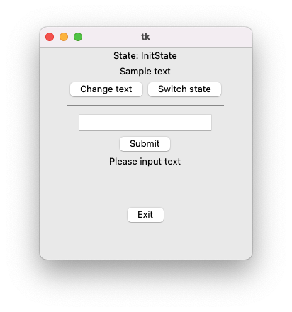
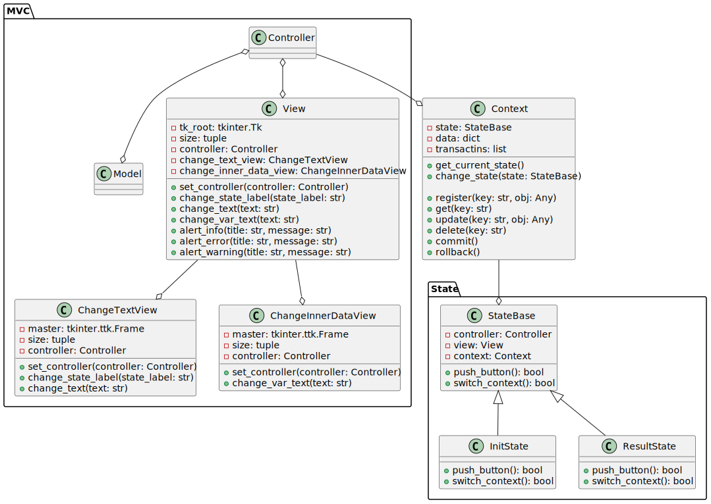

# Tkinter MVC Template


## What is this?

Template of Tkinter application

## Description

- "Switch state" button change state. (InitState <-> ResultState)
- "Change text" button change text ("Sample text"). This behavior varies from state to state.
  - InitState: Random number
  - ResultState: "Change in ResultState"
- "Submit" button change following text to the string of above textbox. If string in textbox is *"invalid"*, app show error dialog, otherwise app show info dialog.
- "Exit" button finishes app.



## Featues

- MVC Architecture
- Modeling state transitions using State Design Patterns
- State and data management using `Context`, which is like DB

## Architecture

Architecture of this template



## Execution

```bash
$ python src/run.py
```